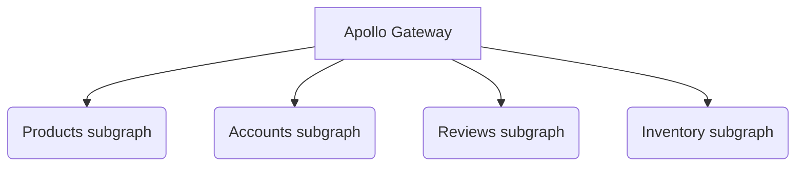

# Federation demo with Netflix dgs

This repository is a Federation example built with [netflix-dgs-framework](https://netflix.github.io/dgs/). 
Subgraphs used in this example are based on the Apollo Federation [documentation](https://www.apollographql.com/docs/federation/).

## Basic Subgraph structure

### Docs

- [Account](accounts/README.md)
- [Product](products/README.md)
- [Review](reviews/README.md)
- [Inventory](inventory/README.md)

